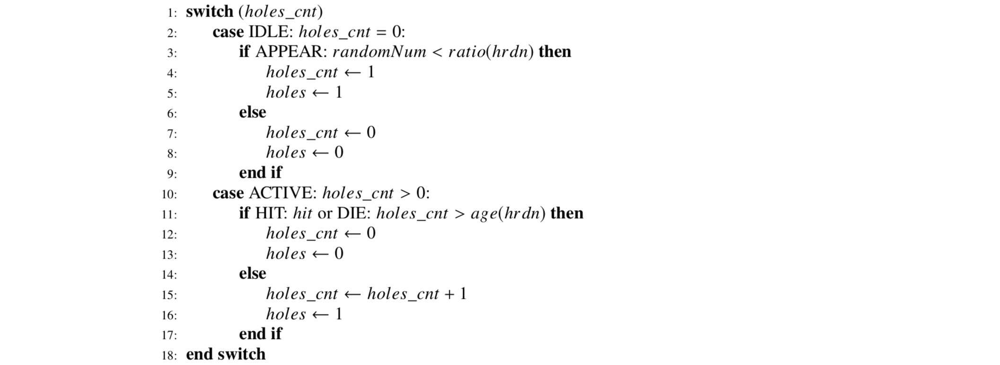

# Whac-A-Mole-FPGA

**A project by Verilog HDL to play the whac-a-mole game on BASYS 2 FPGA board.**

*This work is a part of course project of ES003, spring, 2019.*

***Features:***

* Randomly generate moles and display on 8 LEDs

* Hit moles by toggling switches

* Gain and display score on 3 digital tubes

* Hardness can be automatically or manually changed and display on 1 digital tube

* Pause, resume, and restart game by hitting buttons

## Requirements

Develop and synthesize on Xilinx ISE v14.2.

Run successfully on BASYS 2 FPGA board.

## I/O Design

* 8 switches `SW0` ~ `SW7`: Hit input

* 4 buttons (left to right): Control input

    * `BTN3`: Pause/resume

    * `BTN2`: Decrease hardness manually

    * `BTN1`: Increase hardness manually

    * `BTN0`: Start/restart

* 8 LED `LD0` ~ `LD7`: Indicate moles

* 4 digital tubes (left to right):

    * `AN3`: hardness (0 ~ 9)

    * `AN2` ~ `AN0`: score (000 ~ 999)

## Modules

For modules and whole structure, see [`wam_main.v`](wam_main.v) and following HDL files.

Here we just present two FSMs in pseudocode.

**Moles generator in `wam_gen()`**

**Switch counter in `wam_tap()`**

## Todos

* Better program structure

* Better UI and more interaction hints

* Support for various kinds of I/O devices

## License

See [`LICENSE`](LICENSE) for licensing information.
